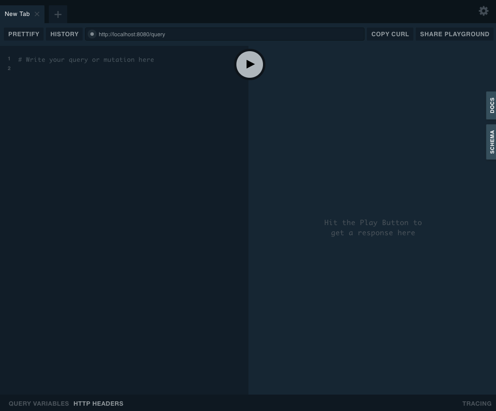
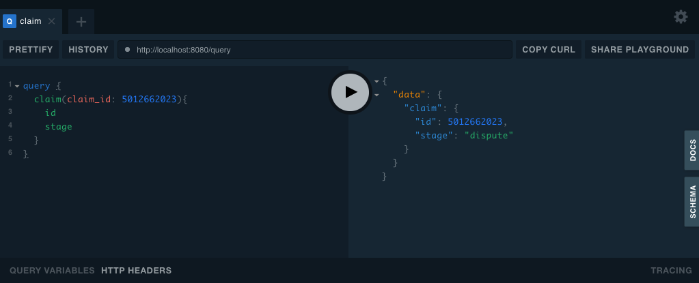
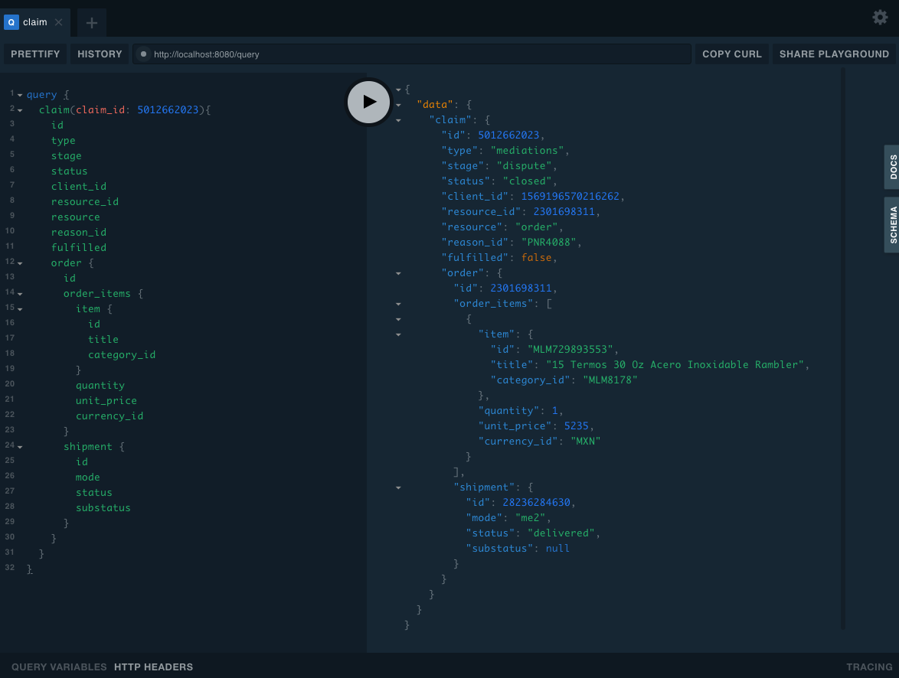

# Post Compra: Dojo Graphql


## Requirements

* Go (recommended version 1.14 or above)
* VPN connection (to access MELI resources)

## Startup

1 - Run server (running this for the first time will download all dependencies)

```
$ cd cmd/api
$ go run server.go
```

2 - Go to web browser and open a new tab on http://localhost:8080/. You should see something like this:



3 - Test the server connection running query below:

```
query {
  claim(claim_id: 5012662023){
    id
    stage
  }
}
```

You should expect this:



You're set to go.


## Generating Models and Resolvers

We are using a lib that auto-generates models and resolvers needed for the graphql application, based on `gqlgen.yml` and `schema.graphqls`.

Steps:
1) Update `schema.graphqls` with new schemas.
2) If you need a new auto generated resolver for a nested model, add it into `gqlgen.yml`.
3) Run `go run github.com/99designs/gqlgen generate` to auto generate models and resolvers.
4) Update the resolvers implementations if necessary.

You can get more info about how it works [here](https://github.com/99designs/gqlgen#gqlgen---).

## The Exercise

You're given a simple graphql application that, given a claim_id and a query, resolves what is necessary to get all the data requested.

You're asked to add *order*, *items* and *shipping* context to a claim, so we could be able to execute a query like:

```
query {
  claim(claim_id: 5012662023){
    id
    type
    stage
    status
    client_id
    resource_id
    resource
    reason_id
    fulfilled
    order {
      id
      order_items {
        item {
          id
          title
          category_id
        }
        quantity
        unit_price
        currency_id
      }
      shipment {
        id
        mode
        status
        substatus
      }
    }
  }
}
```

And we should expect all data fulfilled:



To do that, you will need to update graphql schemas, and generate the necessaries models and resolvers.

## Resources

<!-- TODO: add PPT and other links of interest -->
* [graphql site](https://graphql.org)
* [graphql tutorial](https://www.howtographql.com/)
* [graphql libs for go](https://graphql.org/code/#go)
* [gqlgen](https://github.com/99designs/gqlgen#gqlgen---)
